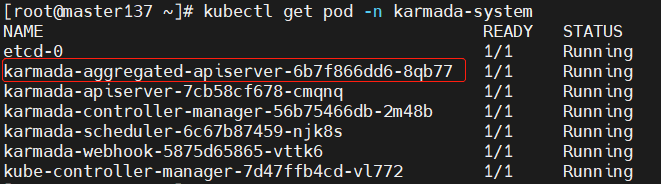
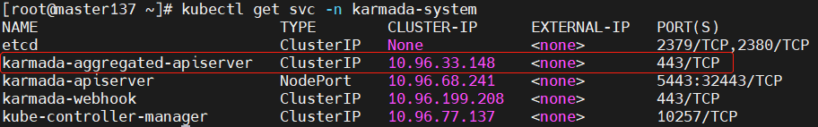
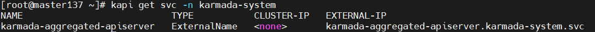
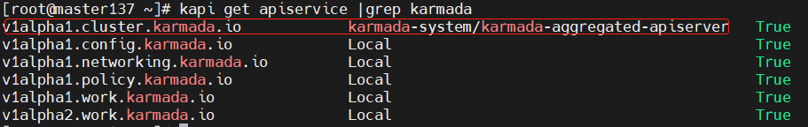
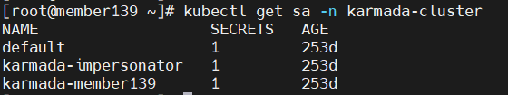
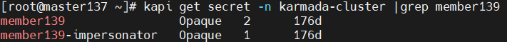
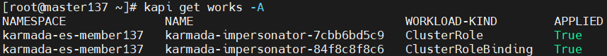
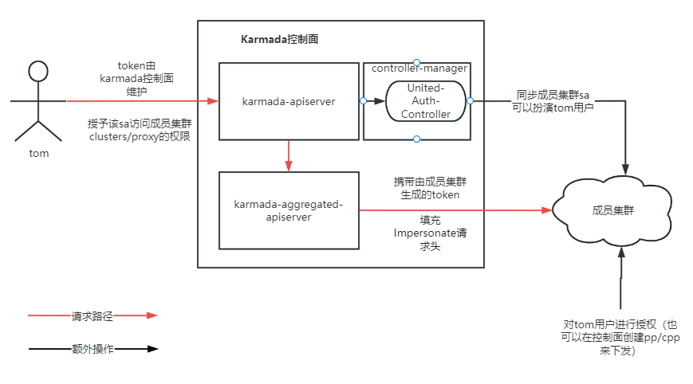

# Karmada聚合APIServer及统一认证鉴权实现原理

Karmada聚合APIServer实现了如`统一多集群API Endpoint`、`统一认证鉴权`等功能，具体使用可以参考文章[告别KubeConfig切换，Karmada开启 “多云一卡通”](https://mp.weixin.qq.com/s/tS3u5oxB-rFsuVPJovWsuQ)。

> 本文基于[Karmada release-v1.4.2](https://github.com/karmada-io/karmada/tree/v1.4.2)源码来分析其实现原理。


## K8s聚合APIServer实现原理

聚合层在 kube-apiserver 进程内运行。在扩展资源注册之前，聚合层不做任何事情。 要注册 API，你可以添加一个**APIService**对象，用它来 “申领” Kubernetes API 中的 URL 路径。 自此以后，聚合层将把发给该 API 路径的所有内容（例如 `/apis/myextension.mycompany.io/v1/…`） 转发到已注册的 APIService。

APIService的最常见实现方式是在集群中某 Pod 内运行，**扩展 API 服务器**。 如果你在使用扩展 API 服务器来管理集群中的资源，该扩展 API 服务器（也被写成“extension-apiserver”） 一般需要和一个或多个控制器一起使用。 apiserver-builder 库同时提供构造扩展 API 服务器和控制器框架代码。

有关启用和配置APIServer聚合层可以参考[官方文档](https://kubernetes.io/zh-cn/docs/tasks/extend-kubernetes/configure-aggregation-layer/#kubernetes-apiserver-%E5%AE%A2%E6%88%B7%E7%AB%AF%E8%AE%A4%E8%AF%81)，其主要涉及到了扩展APIServer的认证鉴权。

### Karmada聚合APIServer工作流程

在安装Karmada之后，`Karmada聚合APIServer`会以Pod的形式运行，并在Host集群中创建一个`Service`。





同时在Karmada控制面会有一个`Service`，以便控制面可以访问到这个Pod



此时查看Karmada控制面的`apiservice`资源，发现将对`Cluster`资源的请求转发到聚合APIServer上了。



### Karmada聚合APIServer源码分析

Karmada以聚合APIService的方式为`Cluster`资源提供服务，这样可以扩展`Cluster`资源的API Endpoint，以提供`proxy`成员集群API的能力，统一了从控制面访问多集群的入口。

#### 构建APIServer

构建APIServer的主要流程是利用k8s提供的`k8s.io/apiserver/pkg/server`构建一个通用的APIServer框架，然后向其中注册`Cluster`资源对象，并为该对象定义`proxy` Endpoint，最后在Karmada的Etcd中，每个`Cluster`对象都会有一个`proxy`Endpoint记录。

先从`aggregatedapiserver`通用构造框架开始。

`cmd/aggregated-apiserver/app/options/options.go`

```golang
// NewOptions returns a new Options.
func NewOptions() *Options {
	// 构建一个通用的配置，并将clusterv1alpha1注册进去，以至于可以将Cluster对象保存到Etcd中
	o := &Options{
		RecommendedOptions: genericoptions.NewRecommendedOptions(
			defaultEtcdPathPrefix,
			aggregatedapiserver.Codecs.LegacyCodec(clusterv1alpha1.SchemeGroupVersion)),
	}
	o.RecommendedOptions.Etcd.StorageConfig.EncodeVersioner = runtime.NewMultiGroupVersioner(clusterv1alpha1.SchemeGroupVersion, schema.GroupKind{Group: clusterv1alpha1.GroupName})
	return o
}

// Config returns config for the api server given Options
func (o *Options) Config() (*aggregatedapiserver.Config, error) {
	// TODO have a "real" external address
	// 创建一个自签证书，用于aggregated apiserver的服务端认证
	if err := o.RecommendedOptions.SecureServing.MaybeDefaultWithSelfSignedCerts("localhost", nil, []net.IP{netutils.ParseIPSloppy("127.0.0.1")}); err != nil {
		return nil, fmt.Errorf("error creating self-signed certificates: %v", err)
	}

	// 允许客户端分页请求Etcd
	o.RecommendedOptions.Etcd.StorageConfig.Paging = utilfeature.DefaultFeatureGate.Enabled(features.APIListChunking)

	// 一个PostStartHooks，在执行了所有ApplyTo()之后启动，此处主要用于设置SharedInformerFactory
	o.RecommendedOptions.ExtraAdmissionInitializers = func(c *genericapiserver.RecommendedConfig) ([]admission.PluginInitializer, error) {
		client, err := clientset.NewForConfig(c.LoopbackClientConfig)
		if err != nil {
			return nil, err
		}
		informerFactory := informers.NewSharedInformerFactory(client, c.LoopbackClientConfig.Timeout)
		o.SharedInformerFactory = informerFactory
		return []admission.PluginInitializer{}, nil
	}
	o.RecommendedOptions.Features = &genericoptions.FeatureOptions{EnableProfiling: false}

	// 为Cluster资源生成一个通用的server config
	serverConfig := genericapiserver.NewRecommendedConfig(aggregatedapiserver.Codecs)
	// 解决proxy成员集群api时，无法识别长连接的问题
	serverConfig.LongRunningFunc = customLongRunningRequestCheck(sets.NewString("watch", "proxy"),
		sets.NewString("attach", "exec", "proxy", "log", "portforward"))
	// 注册Cluster资源的openapi
	serverConfig.OpenAPIConfig = genericapiserver.DefaultOpenAPIConfig(generatedopenapi.GetOpenAPIDefinitions, openapi.NewDefinitionNamer(aggregatedapiserver.Scheme))
	serverConfig.OpenAPIConfig.Info.Title = "Karmada"
	// 把设置的option配置到server config中
	if err := o.RecommendedOptions.ApplyTo(serverConfig); err != nil {
		return nil, err
	}
	// 构造aggregated apiserver config，ExtraConfig可做扩展
	config := &aggregatedapiserver.Config{
		GenericConfig: serverConfig,
		ExtraConfig:   aggregatedapiserver.ExtraConfig{},
	}
	return config, nil
}
```

`pkg/aggregatedapiserver/apiserver.go`

```golang
// Complete fills in any fields not set that are required to have valid data. It's mutating the receiver.
func (cfg *Config) Complete() CompletedConfig {
	c := completedConfig{
	    // 填充通用server config的未设置的值
		cfg.GenericConfig.Complete(),
		&cfg.ExtraConfig,
	}

	c.GenericConfig.Version = &version.Info{
		Major: "1",
		Minor: "0",
	}

	return CompletedConfig{&c}
}

// 关键构建函数，创建一个可以处理Cluster资源对象的APIServer
func (c completedConfig) New(kubeClient kubernetes.Interface) (*APIServer, error) {
	// 创建一个通用的扩展APIServer
	genericServer, err := c.GenericConfig.New("aggregated-apiserver", genericapiserver.NewEmptyDelegate())
	if err != nil {
		return nil, err
	}
	// 封装一个自己的APIServer
	server := &APIServer{
		GenericAPIServer: genericServer,
	}

	// 创建Cluster对象的apiGroup信息
	// 如/apis/cluster.karmada.io/...
	apiGroupInfo := genericapiserver.NewDefaultAPIGroupInfo(clusterapis.GroupName, Scheme, ParameterCodec, Codecs)

	// 构建Cluster存储对象
	clusterStorage, err := clusterstorage.NewStorage(Scheme, kubeClient, c.GenericConfig.RESTOptionsGetter)
	if err != nil {
		klog.Errorf("unable to create REST storage for a resource due to %v, will die", err)
		return nil, err
	}
	// 将REST接口映射到相应的对象存储中，保存到etcd中
	// 如/apis/cluster.karmada.io/v1alpha1/clusters/{cluster}/proxy/...
	v1alpha1cluster := map[string]rest.Storage{}
	v1alpha1cluster["clusters"] = clusterStorage.Cluster
	v1alpha1cluster["clusters/status"] = clusterStorage.Status
	v1alpha1cluster["clusters/proxy"] = clusterStorage.Proxy
	apiGroupInfo.VersionedResourcesStorageMap["v1alpha1"] = v1alpha1cluster

	// 安装apiGroup，里面包括了version和kind，将路径与存储对象对应
	if err = server.GenericAPIServer.InstallAPIGroup(&apiGroupInfo); err != nil {
		return nil, err
	}

	return server, nil
}
```

#### 构建Cluster存储对象及扩展Endpoint

想要扩展APIServer能够识别Cluster的`REST Endpoint`和存储`Cluster对象`，需要自己实现相关的存储结构，并将其与`Endpoint`关联起来。

`pkg/registry/cluster/storage/storage.go`
```golang
// ClusterStorage includes storage for Cluster and for all the subresources.
type ClusterStorage struct {
	Cluster *REST
	Status  *StatusREST
	Proxy   *ProxyREST
}

// NewStorage returns a ClusterStorage object that will work against clusters.
func NewStorage(scheme *runtime.Scheme, kubeClient kubernetes.Interface, optsGetter generic.RESTOptionsGetter) (*ClusterStorage, error) {
	// 为cluster创建一个strategy，实现了Cluster对象的行为，其实现了操作资源对象的常用接口，如CRUD
	strategy := clusterregistry.NewStrategy(scheme)

	// 构建Cluster的存储对象
	store := &genericregistry.Store{
		NewFunc:     func() runtime.Object { return &clusterapis.Cluster{} },
		NewListFunc: func() runtime.Object { return &clusterapis.ClusterList{} },
		// Event过滤器，Etcd只处理与Cluster相关的事件
		PredicateFunc:            clusterregistry.MatchCluster,
		DefaultQualifiedResource: clusterapis.Resource("clusters"),

		// strategy已经实现这这三个操作所需要的接口
		CreateStrategy: strategy,
		UpdateStrategy: strategy,
		DeleteStrategy: strategy,
		// 设置使用kubectl get cluster时的表格输出样式及内容
		TableConvertor: printerstorage.TableConvertor{TableGenerator: printers.NewTableGenerator().With(printersinternal.AddHandlers)},
	}

	// 设置通用注册表的options，并用来填充store的默认配置
	options := &generic.StoreOptions{RESTOptions: optsGetter, AttrFunc: clusterregistry.GetAttrs}
	if err := store.CompleteWithOptions(options); err != nil {
		return nil, err
	}
	// statusStrategy在继承了strategy的基础上，重写了一些必要的接口
	// 因为收集状态的时候，一般不需要额外的操作
	statusStrategy := clusterregistry.NewStatusStrategy(strategy)
	// status也是记录了整个cluster对象的状态，可以复用其存储，并去掉一些不必要的操作
	statusStore := *store
	statusStore.UpdateStrategy = statusStrategy
	statusStore.ResetFieldsStrategy = statusStrategy

	// 为Cluster实现RESTStorage
	clusterRest := &REST{store}
	return &ClusterStorage{
		// Cluster REST存储
		Cluster: clusterRest,
		// Status REST存储
		Status: &StatusREST{&statusStore},
		// Proxy REST存储
		Proxy: &ProxyREST{
			kubeClient:    kubeClient,
			clusterGetter: clusterRest.getCluster,
		},
	}, nil
}

// Implement Redirector.
var _ = rest.Redirector(&REST{})

// ResourceLocation returns a URL to which one can send traffic for the specified cluster.
// 为Cluster REST实现资源重定向接口，可以通过返回的地址，将流量发送到指定集群
func (r *REST) ResourceLocation(ctx context.Context, name string) (*url.URL, http.RoundTripper, error) {
	cluster, err := r.getCluster(ctx, name)
	if err != nil {
		return nil, nil, err
	}

	return proxy.Location(cluster)
}
```

#### 为Cluster实现资源重定向的Proxy功能

首先分析`ProxyREST`实现。

`karmada/pkg/registry/cluster/storage/proxy.go`

```golang
// ProxyREST implements the proxy subresource for a Cluster.
type ProxyREST struct {
	kubeClient    kubernetes.Interface
	clusterGetter func(ctx context.Context, name string) (*clusterapis.Cluster, error)
}

// Implement Connecter
// 为proxy实现connecter接口
var _ = rest.Connecter(&ProxyREST{})
......

// Connect returns a handler for the cluster proxy.
func (r *ProxyREST) Connect(ctx context.Context, id string, options runtime.Object, responder rest.Responder) (http.Handler, error) {
	proxyOpts, ok := options.(*clusterapis.ClusterProxyOptions)
	if !ok {
		return nil, fmt.Errorf("invalid options object: %#v", options)
	}
	// 获取当前集群
	cluster, err := r.clusterGetter(ctx, id)
	if err != nil {
		return nil, err
	}
	// 获取Karmada控制面的secret
	secretGetter := func(ctx context.Context, namespace string, name string) (*corev1.Secret, error) {
		return r.kubeClient.CoreV1().Secrets(namespace).Get(ctx, name, metav1.GetOptions{})
	}
	// 将请求转发到特定集群
	return proxy.ConnectCluster(ctx, cluster, proxyOpts.Path, secretGetter, responder)
}
```

至此，我们已经构造ProxyRest的存储结构，聚合APIServer可以识别到Cluster的`proxy`Endpoint了。

接下来我们需要将请求真正地转发到特定集群。

`pkg/util/proxy/proxy.go`

```golang
// ConnectCluster returns a handler for proxy cluster.
func ConnectCluster(ctx context.Context, cluster *clusterapis.Cluster, proxyPath string,
	secretGetter func(context.Context, string, string) (*corev1.Secret, error), responder rest.Responder) (http.Handler, error) {
	// 从Cluster对象中读取成员集群的APIServer Endpoint 如：https://10.10.102.137:6443
	// 并构建进行http连接的transport
	location, transport, err := Location(cluster)
	if err != nil {
		return nil, err
	}
	// 拼接成员集群的APIServer Endpoint和需要访问的成员集群资源的Path
	location.Path = path.Join(location.Path, proxyPath)

	if cluster.Spec.ImpersonatorSecretRef == nil {
		return nil, fmt.Errorf("the impersonatorSecretRef of cluster %s is nil", cluster.Name)
	}

	// 从控制面访问子集群是通过Impersonator Secret来进行认证鉴权的
	secret, err := secretGetter(ctx, cluster.Spec.ImpersonatorSecretRef.Namespace, cluster.Spec.ImpersonatorSecretRef.Name)
	if err != nil {
		return nil, err
	}

	impersonateToken, err := getImpersonateToken(cluster.Name, secret)
	if err != nil {
		return nil, fmt.Errorf("failed to get impresonateToken for cluster %s: %v", cluster.Name, err)
	}

	// 构建了完整的访问成员集群的Http Handler
	return newProxyHandler(location, transport, impersonateToken, responder)
}


func newProxyHandler(location *url.URL, transport http.RoundTripper, impersonateToken string, responder rest.Responder) (http.Handler, error) {
	return http.HandlerFunc(func(rw http.ResponseWriter, req *http.Request) {
		requester, exist := request.UserFrom(req.Context())
		// 请求必须来自于某个用户
		if !exist {
			responsewriters.InternalError(rw, req, errors.New("no user found for request"))
			return
		}
		// 将该用户设置到"Impersonate-User"请求头中
		req.Header.Set(authenticationv1.ImpersonateUserHeader, requester.GetName())
		for _, group := range requester.GetGroups() {
			// 将请求的用户组信息加入到"Impersonate-Group"请求头中
			if !skipGroup(group) {
				req.Header.Add(authenticationv1.ImpersonateGroupHeader, group)
			}
		}
		// 设置impersonate token
		req.Header.Set("Authorization", fmt.Sprintf("bearer %s", impersonateToken))

		// Retain RawQuery in location because upgrading the request will use it.
		// See https://github.com/karmada-io/karmada/issues/1618#issuecomment-1103793290 for more info.
		location.RawQuery = req.URL.RawQuery

		// 向真正的成员集群API路径发起请求
		handler := NewThrottledUpgradeAwareProxyHandler(location, transport, true, false, responder)
		handler.ServeHTTP(rw, req)
	}), nil
}
```

## Karmada统一认证鉴权实现原理

### 使用统一认证鉴权

通过[Karmada统一认证使用手册](https://karmada.io/docs/userguide/bestpractices/unified-auth/)可以知道，我们需要事先在成员集群中创建对应的用户(User、ServiceAccout等)，并为这个用户授予相应权限。

然后在Karmada控制面也需要生成`同名的用户`，并为其授予访问成员集群`cluster/proxy`资源的权限。

最后就可以在Karmada控制面通过聚合APIServer访问成员集群中的资源了。

> 注意：以上的所有操作可以在Karmada控制面完成，如在控制按创建一个`ServiceAccount`和对应的RBAC，然后通过PropagationPolicy或ClusterPropagationPolicy分发到成员集群中。

### 统一认证鉴权实现原理

从上面对聚合APIServer的分析，可以发现在将请求重定向到成员集群中的时候设置了`Impersonate-User`、`Impersonate-Group`和`Impersonate-Token`，接下来我们分析统一鉴权的实现。

#### 用户伪装(User Impersonation)

一个用户可以通过伪装（Impersonation）头部字段来以**另一个用户的身份**执行操作。 使用这一能力，你可以手动重载请求被身份认证所识别出来的用户信息。例如，管理员可以使用这一功能特性来临时伪装成另一个用户，查看请求是否被拒绝， 从而调试鉴权策略中的问题。带伪装的请求首先会被身份认证识别为发出请求的用户， 之后会切换到使用被伪装的用户的用户信息。

Karmada在注册成员集群的时候，会在成员集群中创建两个`ServiceAccount`。


并将这两个`ServiceAccount`的`token`保存到Karmada控制面，一个用于直接操作子集群，一个用于保存Impersonator的token。



有关统一认证鉴权，我们主要关注`member139-impersonator`。

Karmada为每一个新加入的成员集群都下发名为`karmada-impersonator`的`ClusterRole`和`ClusterRoleBinding`资源。



其主要内容如下：

```yaml
apiVersion: rbac.authorization.k8s.io/v1
kind: ClusterRole
metadata:
  annotations:
    resourcetemplate.karmada.io/uid: ""
  labels:
    work.karmada.io/name: karmada-impersonator-7cbb6bd5c9
    work.karmada.io/namespace: karmada-es-member137
  name: karmada-impersonator
rules:
- apiGroups:
  - ""
  resourceNames:
  - system:admin # 系统管理员角色
  - system:kube-controller-manager
  resources:
  - users
  verbs:
  - impersonate
- apiGroups:
  - ""
  resourceNames:
  - generic-garbage-collector
  - resourcequota-controller
  - namespace-controller
  resources:
  - serviceaccounts
  verbs:
  - impersonate
- apiGroups:
  - ""
  resourceNames:
  - system:masters
  resources:
  - groups
  verbs:
  - impersonate
---
apiVersion: rbac.authorization.k8s.io/v1
kind: ClusterRoleBinding
metadata:
  annotations:
    resourcetemplate.karmada.io/uid: ""
  labels:
    work.karmada.io/name: karmada-impersonator-84f8c8f8c6
    work.karmada.io/namespace: karmada-es-member137
  name: karmada-impersonator
roleRef:
  apiGroup: rbac.authorization.k8s.io
  kind: ClusterRole
  name: karmada-impersonator
subjects:
- kind: ServiceAccount
  name: karmada-impersonator // 授予这个ServiceAccount扮演以上资源的权力
  namespace: karmada-cluster
```

**这两个资源主要是为了给成员集群中的`karmada-impersonator ServiceAccount`动态授予权限（由Unified-Auth-Controller实现），最后聚合APIServer的proxy功能会用这个ServiceAccount的token去访问成员集群中的资源。**

实现统一认证鉴权的关键是要在Karmada控制面能够认证用户，并能够访问成员集群，然后再对成员集群中地资源进行授权。

Karmada控制面首先验证用户能否访问某个成员集群地`clusters/proxy`资源（此时用的是**控制面用户**的Cert或token信息），验证通过后，真正访问子集群时用的是成员集群中的`ServiceAccout`，通过授予该`ServiceAccount`能够扮演哪些User和Group，在成员集群中为这些User和Group授权，来访问成员集群的资源。这样实现了`ServiceAccount`的授权与真正用户的授权解绑，只需要维护`ServiceAccount`能够扮演哪些用户即可。



#### Unified-Auth-Controller

> 代码在`pkg/controllers/unifiedauth/unified_auth_controller.go`

`统一认证Controller`主要用来同步成员集群`karmada-impersonator ServiceAccount`可以扮演的角色，只要在控制面上授予了能够访问该成员集群`clusters/proxy`资源的用户，都会被实时同步（包括删除操纵）。

主要调协对象是`Cluster`

```golang
func (c *Controller) Reconcile(ctx context.Context, req controllerruntime.Request) (controllerruntime.Result, error) {
	klog.V(4).Infof("Reconciling cluster %s", req.NamespacedName.String())

	cluster := &clusterv1alpha1.Cluster{}
	......
	// 通过Cluster的ImpersonatorSecreRef是否为空来判断成员集群是否支持聚合API
	// 如果不支持，则不会进行ClusterRole和ClusterRoleBinding的同步
	if cluster.Spec.ImpersonatorSecretRef == nil {
		klog.Infof("Aggregated API feature is disabled on cluster %s as it does not have an impersonator secret", cluster.Name)
		return controllerruntime.Result{}, nil
	}
    
    // 开始同步Impersonation配置
	err := c.syncImpersonationConfig(cluster)
	......
	
	return controllerruntime.Result{}, nil
}

// 用于同步Impersonation配置
func (c *Controller) syncImpersonationConfig(cluster *clusterv1alpha1.Cluster) error {
	// step1: list all clusterroles
	clusterRoleList := &rbacv1.ClusterRoleList{}
	if err := c.Client.List(context.TODO(), clusterRoleList); err != nil {
		klog.Errorf("Failed to list clusterroles, error: %v", err)
		return err
	}

	// step2: found out clusterroles that matches current cluster
	// 在控制面找到匹配当前集群的包含cluster.karmada.io/clusters/proxy资源的ClusterRole
	allMatchedClusterRoles := sets.NewString()
	for _, clusterRole := range clusterRoleList.Items {
		for i := range clusterRole.Rules {
			if util.PolicyRuleAPIGroupMatches(&clusterRole.Rules[i], clusterProxyAPIGroup) &&
				util.PolicyRuleResourceMatches(&clusterRole.Rules[i], clusterProxyResource) &&
				util.PolicyRuleResourceNameMatches(&clusterRole.Rules[i], cluster.Name) {
				allMatchedClusterRoles.Insert(clusterRole.Name)
				break
			}
		}
	}

	// step3: found out reference clusterRolebindings and collecting subjects.
	// 找到绑定了刚找出来Clusterrole的subjects对象("User", "Group", and "ServiceAccount")
	clusterRoleBindings := &rbacv1.ClusterRoleBindingList{}
	var allSubjects []rbacv1.Subject
	if len(allMatchedClusterRoles) != 0 {
		if err := c.Client.List(context.TODO(), clusterRoleBindings); err != nil {
			klog.Errorf("Failed to list clusterrolebindings, error: %v", err)
			return err
		}

		for _, clusterRoleBinding := range clusterRoleBindings.Items {
			if clusterRoleBinding.RoleRef.Kind == util.ClusterRoleKind && allMatchedClusterRoles.Has(clusterRoleBinding.RoleRef.Name) {
				allSubjects = append(allSubjects, clusterRoleBinding.Subjects...)
			}
		}
	}

	// step4:  generate rules for impersonation
	// 构造当前成员集群karmada-impersonator的ClusterRole的规则
	rules := util.GenerateImpersonationRules(allSubjects)

	// step5: sync clusterrole to cluster for impersonation
	// 将该clusterrole直接以Work的形式同步到成员集群中（该clusterrole可以根据前面的rule动态更新）
	if err := c.buildImpersonationClusterRole(cluster, rules); err != nil {
		klog.Errorf("failed to sync impersonate clusterrole to cluster(%s): %v", cluster.Name, err)
		return err
	}

	// step6: sync clusterrolebinding to cluster for impersonation
	// 同步关联成员集群ServiceAccount与该clusterrole的ClusterRoleBinding
	if err := c.buildImpersonationClusterRoleBinding(cluster); err != nil {
		klog.Errorf("failed to sync impersonate clusterrolebinding to cluster(%s): %v", cluster.Name, err)
		return err
	}

	return nil
}
```

## 参考

[告别KubeConfig切换，Karmada开启 “多云一卡通”](https://mp.weixin.qq.com/s/tS3u5oxB-rFsuVPJovWsuQ)  
[访问集群-发现内建服务](https://v1-22.docs.kubernetes.io/zh/docs/tasks/access-application-cluster/access-cluster/#%E5%8F%91%E7%8E%B0%E5%86%85%E5%BB%BA%E6%9C%8D%E5%8A%A1)  
[用户伪装(user-impersonation)](https://kubernetes.io/zh-cn/docs/reference/access-authn-authz/authentication/#user-impersonation)  
[Karmada Unified Authentication](https://karmada.io/docs/userguide/bestpractices/unified-auth/)
