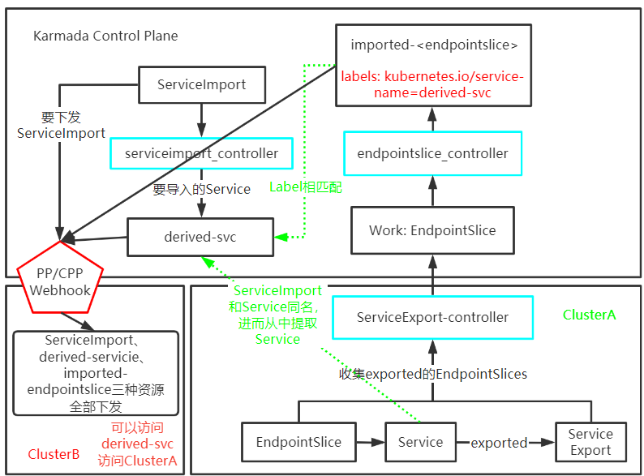
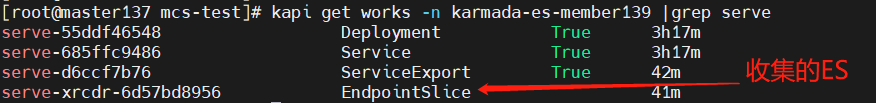
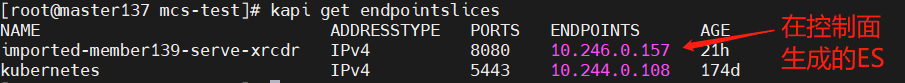
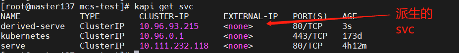
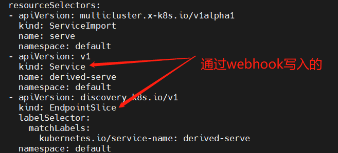
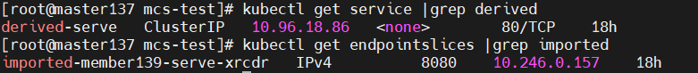
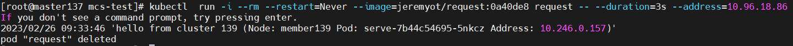
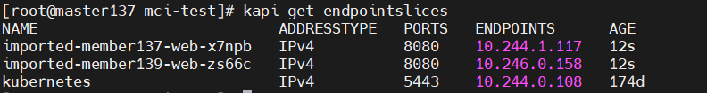
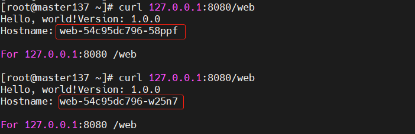

# Karmada多云服务发现MCS及MCI实现原理

Karmada的MCS（Multi-Cluster Service）和MCI（Multi-Cluster Ingress）主要是为应用提供跨Kubernetes集群的服务发现能力，以及将外部流量导入到多集群中，实现跨集群的负载均衡能力。


> 本文基于[Karmada release-v1.4.2](https://github.com/karmada-io/karmada/tree/v1.4.2)源码来分析其实现原理。

## MCS（Multi Cluster Service）

Karmada基于Kubernetes多集群兴趣小组的[mcs-api](https://github.com/kubernetes-sigs/mcs-api)实现了多集群服务发现。

> 注意：使用该功能，首先得打通多集群的容器网络，可以通过[部署Submariner](https://karmada.io/docs/userguide/network/working-with-submariner)来实现。
> 目前暂不支持Submariner的Global IP模式，所以需要每个集群有单独的cluster-cidr(Pod网段)。
>如member137：10.244.0.0/16，member139：10.246.0.0/16

### 基本用法示例

将member139集群中的`serve`服务暴露给member137集群中的应用。

> 注意：当前测试环境为Karmada控制面安装在member137主机上，在member137上执行`kapi`等于访问Karmada控制面，执行`kubectl`等于访问member137集群。以下截图均以此环境为例。

1. 在控制面部署Deployment和Service，并将其分发到member139中

```
apiVersion: apps/v1
kind: Deployment
metadata:
  name: serve
spec:
  replicas: 1
  selector:
    matchLabels:
      app: serve
  template:
    metadata:
      labels:
        app: serve
    spec:
      containers:
      - name: serve
        image: jeremyot/serve:0a40de8
        args:
        - "--message='hello from cluster member139 (Node: {{env \"NODE_NAME\"}} Pod: {{env \"POD_NAME\"}} Address: {{addr}})'"
        env:
          - name: NODE_NAME
            valueFrom:
              fieldRef:
                fieldPath: spec.nodeName
          - name: POD_NAME
            valueFrom:
              fieldRef:
                fieldPath: metadata.name
---      
apiVersion: v1
kind: Service
metadata:
  name: serve
spec:
  ports:
  - port: 80
    targetPort: 8080
  selector:
    app: serve
---
apiVersion: policy.karmada.io/v1alpha1
kind: PropagationPolicy
metadata:
  name: mcs-workload
spec:
  resourceSelectors:
    - apiVersion: apps/v1
      kind: Deployment
      name: serve
    - apiVersion: v1
      kind: Service
      name: serve
  placement:
    clusterAffinity:
      clusterNames:
        - member139
```

2. 在控制面部署ServiceExport，分发到member139中
```
apiVersion: multicluster.x-k8s.io/v1alpha1
kind: ServiceExport
metadata:
  name: serve
---
apiVersion: policy.karmada.io/v1alpha1
kind: PropagationPolicy
metadata:
  name: serve-export-policy
spec:
  resourceSelectors:
    - apiVersion: multicluster.x-k8s.io/v1alpha1
      kind: ServiceExport
      name: serve
  placement:
    clusterAffinity:
      clusterNames:
        - member139
```

3. 在控制面部署ServiceImport，并分发到member137中

```
apiVersion: multicluster.x-k8s.io/v1alpha1
kind: ServiceImport
metadata:
  name: serve
spec:
  type: ClusterSetIP
  ports:
  - port: 80
    protocol: TCP
---
apiVersion: policy.karmada.io/v1alpha1
kind: PropagationPolicy
metadata:
  name: serve-import-policy
spec:
  resourceSelectors:
    - apiVersion: multicluster.x-k8s.io/v1alpha1
      kind: ServiceImport
      name: serve
  placement:
    clusterAffinity:
      clusterNames:
        - member137
```

4. 在member137中访问这个派生的服务

```
[root@master137 mcs-test]# kubectl get service |grep derived
derived-serve   ClusterIP   10.96.18.86   <none>        80/TCP    18h
[root@master137 mcs-test]# kubectl  run -i --rm --restart=Never --image=jeremyot/request:0a40de8 request -- --duration=3s --address=10.96.18.86
If you don't see a command prompt, try pressing enter.
2023/02/26 09:33:46 'hello from cluster 139 (Node: member139 Pod: serve-7b44c54695-5nkcz Address: 10.246.0.157)'
pod "request" deleted
```

### 原理分析

主要通过三个controller和webhook机制来同步`ServiceExport`、`ServiceImport`和`EndpointSlice`等资源。



**一句话总结**：收集成员集群中Export的Service的EndpointSlice到控制面，通过控制面将Import的Service下发到各成员集群中。

#### ServiceExport-controller（需要访问子集群）

> 代码在`pkg/controllers/mcs/service_export_controller.go`

这个controller主要用于监听Karmada下发到成员集群中的`ServiceExport`资源（**不会处理非Karmada管理的资源**），并将子集群Export的`Service`的`EndpointSlice`上报给Karmada控制面。



调协对象是包含`ServiceExport`资源的`Work`对象。
```golang
// Reconcile performs a full reconciliation for the object referred to by the Request.
func (c *ServiceExportController) Reconcile(ctx context.Context, req controllerruntime.Request) (controllerruntime.Result, error) {
	klog.V(4).Infof("Reconciling Work %s", req.NamespacedName.String())
    ......
	if !isWorkContains(work.Spec.Workload.Manifests, serviceExportGVK) {
		return controllerruntime.Result{}, nil
	}
```

ServiceExport-controller中通过一个限速队列WorkQueue来异步的向控制面同步成员集群中的**ServiceExport**和**EndpointSlices**。

```golang
// RunWorkQueue initializes worker and run it, worker will process resource asynchronously.
func (c *ServiceExportController) RunWorkQueue() {
	workerOptions := util.Options{
		Name:          "service-export",
		KeyFunc:       nil,
		ReconcileFunc: c.syncServiceExportOrEndpointSlice,
	}
	c.worker = util.NewAsyncWorker(workerOptions)
	c.worker.Run(c.WorkerNumber, c.StopChan)
}
```

**EndpointSlice in member cluster --> Work including EndpointSlice in control plane**

**如果处理的资源类型是`ServiceExport`:** 

`handleServiceExportEvent`根据`成员集群中ServiceExport资源事件`将`EndpointSlice`对象同步到Karmada控制面。

- 如果是Create和Update事件，则在控制面创建一个包含这个Service的`EndpointSlice`的`Work`对象（这个`Work`只用来保存上报的`EndpointSlice`, 会被设置`propagation.karmada.io/instruction:suppressed`标签，不会被Apply到子集群中）。
- 如果成员集群中的`ServiceExport`已经被删除了，则删除已经同步给控制面的包含`EndpointSlice`资源的`Work`对象。

```golang
// handleServiceExportEvent syncs EndPointSlice objects to control-plane according to ServiceExport event.
// For ServiceExport create or update event, reports the referencing service's EndpointSlice.
// For ServiceExport delete event, cleanup the previously reported EndpointSlice.
func (c *ServiceExportController) handleServiceExportEvent(serviceExportKey keys.FederatedKey) error {
	_, err := helper.GetObjectFromCache(c.RESTMapper, c.InformerManager, serviceExportKey)
	if err != nil {
		if apierrors.IsNotFound(err) {
			return cleanupWorkWithServiceExportDelete(c.Client, serviceExportKey)
		}
		return err
	}

	// Even though the EndpointSlice will be synced when dealing with EndpointSlice events, thus the 'report' here may
	// be redundant, but it helps to avoid a corner case:
	// If skip report here, after ServiceExport deletion and re-creation, if no EndpointSlice changes, we didn't get a
	// change to sync.
	// 这里主要是因为ServiceExport的改变，并不会影响到对应Service的EndpointSlices
	if err = c.reportEndpointSliceWithServiceExportCreate(serviceExportKey); err != nil {
		klog.Errorf("Failed to handle ServiceExport(%s) event, Error: %v",
			serviceExportKey.NamespaceKey(), err)
		return err
	}

	return nil
}
```

> 注意：一个`Service`可能会对应多个`EndpointSlice`，所以在控制面也会生成多个`Work`。如果`ServiceExport`被删除了，会删除对应的所有`Work`。

**如果处理的类型是EndpointSlice:**

`handleEndpointSliceEvent`根据`成员集群中EndpointSlice事件`将`EndpointSlice`对象同步到控制平面。

> 注意：与监听`ServiceExport`事件不同，这里是一个一个地报告`EndpointSlice`，而监听到`ServiceExport`是同步对应`Service`的全部EndpointSlice。

- 对于EndpointSlice创建或更新事件，向控制面报告EndpointSlice（也是通过创建Work的方式）。
- 对于EndpointSlice删除事件，清除之前报告的EndpointSlice。

```
// handleEndpointSliceEvent syncs EndPointSlice objects to control-plane according to EndpointSlice event.
// For EndpointSlice create or update event, reports the EndpointSlice when referencing service has been exported.
// For EndpointSlice delete event, cleanup the previously reported EndpointSlice.
func (c *ServiceExportController) handleEndpointSliceEvent(endpointSliceKey keys.FederatedKey) error {
	endpointSliceObj, err := helper.GetObjectFromCache(c.RESTMapper, c.InformerManager, endpointSliceKey)
	if err != nil {
		if apierrors.IsNotFound(err) {
			return cleanupWorkWithEndpointSliceDelete(c.Client, endpointSliceKey)
		}
		return err
	}

	if err = c.reportEndpointSliceWithEndpointSliceCreateOrUpdate(endpointSliceKey.Cluster, endpointSliceObj); err != nil {
		klog.Errorf("Failed to handle endpointSlice(%s) event, Error: %v",
			endpointSliceKey.NamespaceKey(), err)
		return err
	}

	return nil
}
```

创建一个Work，该Work中记录对应Service的EndpointSlice，将子集群==已经exported的Service==中的EndpointSlice同步到Karmada控制面。（注意：ServiceExport的name就是要export的Service的name，spec中不需要填值）。


#### EndpointSlice-controller

> 代码在`pkg/controllers/mcs/endpointslice_controller.go`

这个controller主要根据成员集群上报的`包含EndpointSlice的Work`，在控制面创建对应的`EndpointSlice`。



调协对象是`Work`。

会在Karmada控制面对应的namespace下创建一个`EndpointSlice`，名称为`imported-<clusterName>-<endpointSliceName>`。

并给这个`EndpointSlice`打上标签`kubernetes.io/service-name: derived-<serviceName>`，这样当创建了ServiceImport之后，这个`EndpointSlice`将关联生成的名为`derived-<serviceName>`的`Service`。

```golang
func (c *EndpointSliceController) collectEndpointSliceFromWork(work *workv1alpha1.Work) (controllerruntime.Result, error) {
	clusterName, err := names.GetClusterName(work.Namespace)
	if err != nil {
		klog.Errorf("Failed to get cluster name for work %s/%s", work.Namespace, work.Name)
		return controllerruntime.Result{Requeue: true}, err
	}

	for _, manifest := range work.Spec.Workload.Manifests {
		unstructObj := &unstructured.Unstructured{}
		if err := unstructObj.UnmarshalJSON(manifest.Raw); err != nil {
			klog.Errorf("Failed to unmarshal workload, error is: %v", err)
			return controllerruntime.Result{Requeue: true}, err
		}

		endpointSlice := &discoveryv1.EndpointSlice{}
		err = helper.ConvertToTypedObject(unstructObj, endpointSlice)
		if err != nil {
			klog.Errorf("failed to convert unstructured to typed object: %v", err)
			return controllerruntime.Result{Requeue: true}, err
		}
		// 生成即将在控制面创建的EndpointSlice
		desiredEndpointSlice := deriveEndpointSlice(endpointSlice, clusterName)
		desiredEndpointSlice.Labels = map[string]string{
			workv1alpha1.WorkNamespaceLabel: work.Namespace,
			workv1alpha1.WorkNameLabel:      work.Name,
			discoveryv1.LabelServiceName:    names.GenerateDerivedServiceName(work.Labels[util.ServiceNameLabel]),
		}

		if err = helper.CreateOrUpdateEndpointSlice(c.Client, desiredEndpointSlice); err != nil {
			return controllerruntime.Result{Requeue: true}, err
		}
	}

	return controllerruntime.Result{}, nil
}
```

#### ServiceImport-controller

这个controller主要根据`控制面上的ServiceImport`创建`derived-service`。



调协对象是`ServiceImport`。

> 注意：这个`ServiceImport`的名称要和`需要import的Service`和`成员集群中想要export的Service`的名称一致

暂时只支持`ClusterSetIP`类型的`ServiceImport`.（另一种类型是`Headless`）

```golang
// Reconcile performs a full reconciliation for the object referred to by the Request.
func (c *ServiceImportController) Reconcile(ctx context.Context, req controllerruntime.Request) (controllerruntime.Result, error) {
	klog.V(4).Infof("Reconciling ServiceImport %s.", req.NamespacedName.String())

    ......
	if !svcImport.DeletionTimestamp.IsZero() || svcImport.Spec.Type != mcsv1alpha1.ClusterSetIP {
		return controllerruntime.Result{}, nil
	}

	if err := c.deriveServiceFromServiceImport(svcImport); err != nil {
		c.EventRecorder.Eventf(svcImport, corev1.EventTypeWarning, events.EventReasonSyncDerivedServiceFailed, err.Error())
		return controllerruntime.Result{Requeue: true}, err
	}
	c.EventRecorder.Eventf(svcImport, corev1.EventTypeNormal, events.EventReasonSyncDerivedServiceSucceed, "Sync derived service for serviceImport(%s) succeed.", svcImport.Name)
	return controllerruntime.Result{}, nil
}
```

如果`derived service`已经存在，则会更新其状态，主要是负载均衡器，端口数可能会发生变化。

#### webhook修改pp/cpp
> 代码在`pkg/webhook/propagationpolicy/mutating.go`和`pkg/webhook/clusterpropagationpolicy/mutating.go`


当用户创建`PropagationPolicy`或`ClusterPropagationPolicy`来传播`ServiceImport`资源时，Karmada将会添加`ResourceSelector`来传播与`ServiceImport`有关的`derived-service`和`Endpointslice`到子集群中（==通过`Mutating-Webhook-Configuration`修改PP或CPP来实现的==）。



```golang
// Handle yields a response to an AdmissionRequest.
func (a *MutatingAdmission) Handle(ctx context.Context, req admission.Request) admission.Response {
	policy := &policyv1alpha1.PropagationPolicy{}
	......
	// 检查是否包含ServiceImport，如果有，为其添加derived-service和关联的EndpointSlice
	// 以分发到成员集群，实现跨集群的服务发现
	addedResourceSelectors := helper.GetFollowedResourceSelectorsWhenMatchServiceImport(policy.Spec.ResourceSelectors)
	if addedResourceSelectors != nil {
		policy.Spec.ResourceSelectors = append(policy.Spec.ResourceSelectors, addedResourceSelectors...)
	}
    ......
	return admission.PatchResponseFromRaw(req.Object.Raw, marshaledBytes)
}
```
`cmd/webhook/app/webhook.go`下注册这两个webhook
```
klog.Info("registering webhooks to the webhook server")
	hookServer := hookManager.GetWebhookServer()
	hookServer.Register("/mutate-propagationpolicy", &webhook.Admission{Handler: propagationpolicy.NewMutatingHandler(
		opts.DefaultNotReadyTolerationSeconds, opts.DefaultUnreachableTolerationSeconds)})
	......
	hookServer.Register("/mutate-clusterpropagationpolicy", &webhook.Admission{Handler: clusterpropagationpolicy.NewMutatingHandler(
		opts.DefaultNotReadyTolerationSeconds, opts.DefaultUnreachableTolerationSeconds)})
```

这样就可以把在控制面`ServiceImport`的所有`EndpointSlice`资源同时下发到`需要访问 这个service的成员集群`中，只要容器网络是通的，子集群也可以访问这个`derived-service`。






## MCI（Multi Cluster Ingress）

Karmada基于[kubernetes/ingress-nginx](https://github.com/kubernetes/ingress-nginx)实现了[Multi-Cluster-Ingress](https://github.com/karmada-io/multi-cluster-ingress-nginx)，实现跨集群的反向代理和负载均衡。

### 原理分析

通过`MCS`可以实现多集群的东西向流量治理，我们还需要实现南北向的流量，在Kubernetes中提供Ingress资源来向集群外暴露服务，同样在Karmada中，也实现了`Multi-Cluster -Ingress`资源来向外统一暴露多集群服务。

具体安装可参考[官方文档](https://karmada.io/docs/userguide/service/multi-cluster-ingress#step-1-deploy-ingress-nginx-on-the-host-cluster)。

基本原理是，首先通过部署`MCS`，导出成员集群中的Service，并部署`ServiceImport`资源，这时在控制面生成了`derived-<service>`服务，MCI资源中只需要填写`<service>`名称即可，[MCI控制器会自动地为其添加`derived-`前缀](https://github.com/karmada-io/multi-cluster-ingress-nginx/blob/f823d148656c2885b05883fdb793d548f9e717cb/internal/ingress/controller/controller_mci.go#L405)，然后匹配对应的`EndpointSliece`资源。

### 基本用法

在Karmada控制面，创建如下资源，将其分发到`member137`、`member139`两个成员集群中：

1. 在Karmada控制面，创建web应用，并分发到成员集群中
```
apiVersion: apps/v1
kind: Deployment
metadata:
  name: web
spec:
  replicas: 1
  selector:
    matchLabels:
      app: web
  template:
    metadata:
      labels:
        app: web
    spec:
      containers:
      - name: hello-app
        image: hansd/hello-app
        ports:
        - containerPort: 8080
          protocol: TCP
---
apiVersion: v1
kind: Service
metadata:
  name: web
spec:
  ports:
  - port: 81
    targetPort: 8080
  selector:
    app: web
---
apiVersion: policy.karmada.io/v1alpha1
kind: PropagationPolicy
metadata:
  name: mci-workload
spec:
  resourceSelectors:
    - apiVersion: apps/v1
      kind: Deployment
      name: web
    - apiVersion: v1
      kind: Service
      name: web
  placement:
    clusterAffinity:
      clusterNames:
        - member137
        - member139
```

2. 在控制面部署ServiceExport资源，并分发到成员集群中
```
apiVersion: multicluster.x-k8s.io/v1alpha1
kind: ServiceExport
metadata:
  name: web
---
apiVersion: policy.karmada.io/v1alpha1
kind: PropagationPolicy
metadata:
  name: web-export-policy
spec:
  resourceSelectors:
    - apiVersion: multicluster.x-k8s.io/v1alpha1
      kind: ServiceExport
      name: web
  placement:
    clusterAffinity:
      clusterNames:
        - member137
        - member139
```

这时在控制面收集到了两个成员集群中对应的`EndpointSlice`



3. 在控制面创建`ServiceImport`资源

```
apiVersion: multicluster.x-k8s.io/v1alpha1
kind: ServiceImport
metadata:
  name: web
spec:
  type: ClusterSetIP
  ports:
  - port: 81
    protocol: TCP
```

4. 在控制面创建MCI资源，向外暴露web服务

```
apiVersion: networking.karmada.io/v1alpha1
kind: MultiClusterIngress
metadata:
  name: demo-localhost
  namespace: default
spec:
  ingressClassName: nginx
  rules:
  - http:
      paths:
      - backend:
          service:
            name: web
            port:
              number: 81
        path: /web
        pathType: Prefix
```

5. 测试在外部访问服务

```bash
# 先向ingress-nginx转发到本地主机端口
[root@master137 mci-test]# kubectl port-forward --namespace=ingress-nginx service/ingress-nginx-controller 8080:80
Forwarding from 127.0.0.1:8080 -> 80
Forwarding from [::1]:8080 -> 80
```

访问服务，可以发现每次访问的是不同的服务，这两个服务分别来自member137和member139。



至此，顺利实现了`多集群应用的反向代理`和`应用的跨集群负载均衡`。

## 参考

[Karmada Multi-cluster Service Discovery](https://karmada.io/docs/userguide/service/multi-cluster-service)  
[Karmada Multi-cluster Ingress](https://karmada.io/docs/userguide/service/multi-cluster-ingress)
