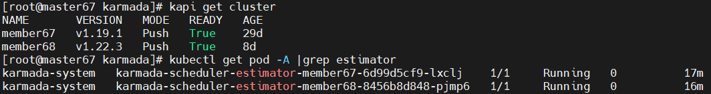

# Karmada调度器Estimator功能及实现原理

用户可以根据成员集群的可用资源将他们的工作负载副本划分到不同的集群中。当某些集群缺乏资源时，调度器根据`Estimator`反馈的结果，不会将过多的副本分配给这些集群。

目前Karmada有两种Estimator，分别是`General-Estimator`和`Scheduler-Estimator`。

> 本文基于[Karmada release-v1.5.0](https://github.com/karmada-io/karmada/tree/v1.5.0)源码来分析其实现原理。

## 基本原理

`karmada-scheduler`在调度时，会参考所有`Estimator`统计的成员集群可支持的最大副本数，选择其中最小值作为该最后的评估值。

主要包括三种方式：

- **基于`ClusterSummary`的评估**，根据整个成员集群的可用资源计算支持的最大副本数。但是该方式粒度比较粗，比如，有100个1核的节点，则集群总资源是100核，按照该方法统计，可支持50个2核的Pod，但是没有一个节点能运行该Pod，调度不成功。
- **基于`ResourceModuling`的评估**，划分一个个的资源范围，统计属于这些范围的节点，然后调度副本时，通过这些资源范围来计算支持的最大副本数。
- **精确评估**：该功能依赖于`karmada-scheduler-estimator`组件，每次评估时，会访问子集群，统计每个节点的最大副本数，然后求和。

前两种属于`General-Estimator`，评估时不需要访问子集群；精确评估属于`Scheduler-Estimator`，评估时需要通过`karmada-scheduler-estimator`访问子集群。

以下是`karmada-scheduler`计算成员集群可用副本数时的关键部分，该代码会被`pkg/scheduler/core/generic_scheduler.go`和`pkg/scheduler/core/division_algorithm.go`用到。

`karmada/pkg/scheduler/core/util.go`
```golang
func calAvailableReplicas(clusters []*clusterv1alpha1.Cluster, spec *workv1alpha2.ResourceBindingSpec) []workv1alpha2.TargetCluster {
	availableTargetClusters := make([]workv1alpha2.TargetCluster, len(clusters))

	// Set the boundary.
	for i := range availableTargetClusters {
		availableTargetClusters[i].Name = clusters[i].Name
		availableTargetClusters[i].Replicas = math.MaxInt32
	}

	// Get the minimum value of MaxAvailableReplicas in terms of all estimators.
	// 获取所有副本评估器，包括general和accurate
	estimators := estimatorclient.GetReplicaEstimators()
	ctx := context.WithValue(context.TODO(), util.ContextKeyObject,
		fmt.Sprintf("kind=%s, name=%s/%s", spec.Resource.Kind, spec.Resource.Namespace, spec.Resource.Name))
	for _, estimator := range estimators {
		res, err := estimator.MaxAvailableReplicas(ctx, clusters, spec.ReplicaRequirements)
		if err != nil {
			klog.Errorf("Max cluster available replicas error: %v", err)
			continue
		}
		for i := range res {
			// 如果返回的副本数不合法，则跳过，主要用于Accurate评估器中，不合法的情况
			if res[i].Replicas == estimatorclient.UnauthenticReplica {
				continue
			}
			// 取每种评估结果的最小值
			if availableTargetClusters[i].Name == res[i].Name && availableTargetClusters[i].Replicas > res[i].Replicas {
				availableTargetClusters[i].Replicas = res[i].Replicas
			}
		}
	}

	// In most cases, the target cluster max available replicas should not be MaxInt32 unless the workload is best-effort
	// and the scheduler-estimator has not been enabled. So we set the replicas to spec.Replicas for avoiding overflow.
	// 这种情况主要发生在基于ResourceModel的评估没有开启时，scheduler-estimator也没有开启时
	// 只有CluserSummary评估时，如果没有设置ResourceRequest，则会设置最大值
	for i := range availableTargetClusters {
		if availableTargetClusters[i].Replicas == math.MaxInt32 {
			availableTargetClusters[i].Replicas = spec.Replicas
		}
	}

	klog.V(4).Infof("Target cluster: %v", availableTargetClusters)
	return availableTargetClusters
}

```

## 源码分析

### General-Estimator

> Karmada在v1.3版本引入了`Cluster Resource Modeling`, 在v1.4版本中升级为Beta并默认开启，可以通过设置`karmada-scheduler`、`karmada-aggregated-apiserver`、`karmada-controller-manager`的参数`--feature-gates=CustomizedClusterResourceModeling=false`来关闭。

`General-Estimator`中有两种统计方式，分别为`BasedOnClusterSummary`和`BasedOnResourceModels`。

如果开启了`CustomizedClusterResourceModeling`特性，则仅使用`BasedOnResourceModels`的统计方式。

如果**工作负载模板**（Deployment）中没有定义`ResourceRequest`，则直接返回集群**还可以支持的最大Pod数**。

`pkg/estimator/client/general.go`
```golang
func (ge *GeneralEstimator) maxAvailableReplicas(cluster *clusterv1alpha1.Cluster, replicaRequirements *workv1alpha2.ReplicaRequirements) int32 {
	resourceSummary := cluster.Status.ResourceSummary
	if resourceSummary == nil {
		return 0
	}
	// 先统计支持的Pod最大数
	maximumReplicas := getAllowedPodNumber(resourceSummary)
	if maximumReplicas <= 0 {
		return 0
	}

	// 如果没有设置资源需求，则直接返回节点还支持的最大Pod数
	if replicaRequirements == nil {
		return int32(maximumReplicas)
	}

	// if the allocatableModelings from the cluster status are empty possibly due to
	// users have not set the models or the state has not been collected,
	// we consider to use another way to calculate the max replicas.
	if features.FeatureGate.Enabled(features.CustomizedClusterResourceModeling) && len(cluster.Status.ResourceSummary.AllocatableModelings) > 0 {
		// 基于资源模型的统计结果
		num, err := getMaximumReplicasBasedOnResourceModels(cluster, replicaRequirements)
		if err == nil {
			klog.Infof("cluster %s has max available replicas: %d according to cluster resource models", cluster.GetName(), num)
			if num < maximumReplicas {
				maximumReplicas = num
			}

			return int32(maximumReplicas)
		}
		klog.Info(err.Error())
	}
	// 基于集群资源的统计结果
	num := getMaximumReplicasBasedOnClusterSummary(resourceSummary, replicaRequirements)
	if num < maximumReplicas {
		maximumReplicas = num
	}
	// 最后返回所有评估里面最小的值
	return int32(maximumReplicas)
}
```

#### 基于`ClusterResourceSummary`的评估

该评估方式是最基础的版本，根据`Cluster`对象中收集到成员集群资源总体情况（包括CPU、内存、磁盘空间和Pod数等），统计该集群可支持的最大副本数（取**每种资源**能够支持的副本的**最小值**）。

> 该评估方法以集群整体资源来统计可支持的最大副本数，粒度比较粗，可能存在成员集群资源碎片的问题，导致虽然总体资源满足，但是具体的节点并不满足运行该Pod，从而调度失败。


```shell
$ kapi get clusters member68 -oyaml
apiVersion: cluster.karmada.io/v1alpha1
kind: Cluster
......
status:
  ......
  kubernetesVersion: v1.22.3
  nodeSummary:
    readyNum: 1
    totalNum: 1
  resourceSummary:
    allocatable:
      cpu: "4"
      ephemeral-storage: "25109519114"
      hugepages-1Gi: "0"
      hugepages-2Mi: "0"
      memory: 3929936Ki
      pods: "110"
    allocated:
      cpu: 1990m
      memory: 638Mi
      pods: "12"
```

`pkg/estimator/client/general.go`
```golang
func getMaximumReplicasBasedOnClusterSummary(resourceSummary *clusterv1alpha1.ResourceSummary, replicaRequirements *workv1alpha2.ReplicaRequirements) int64 {
	var maximumReplicas int64 = math.MaxInt64
	for key, value := range replicaRequirements.ResourceRequest {
		// key为资源名，value为数量
		requestedQuantity := value.Value()
		if requestedQuantity <= 0 {
			// 需求为0，不用比较
			continue
		}

		// calculates available resource quantity
		// available = allocatable - allocated - allocating
		// 统计集群有多少这些资源
		allocatable, ok := resourceSummary.Allocatable[key]
		if !ok {
			return 0
		}
		allocated, ok := resourceSummary.Allocated[key]
		if ok {
			allocatable.Sub(allocated)
		}
		allocating, ok := resourceSummary.Allocating[key]
		if ok {
			allocatable.Sub(allocating)
		}
		// 转成整数
		availableQuantity := allocatable.Value()
		// short path: no more resource left.
		if availableQuantity <= 0 {
			return 0
		}
		// 如果是CPU，转成毫核统计
		if key == corev1.ResourceCPU {
			requestedQuantity = value.MilliValue()
			availableQuantity = allocatable.MilliValue()
		}

		// 该资源能支持的副本数，最终取最小副本数
		maximumReplicasForResource := availableQuantity / requestedQuantity
		if maximumReplicasForResource < maximumReplicas {
			maximumReplicas = maximumReplicasForResource
		}
	}

	return maximumReplicas
}
```

#### 基于`ResourceModels`的评估

为克服集群资源碎片的问题，Karmada为每个集群引入一个`CustomizedClusterResourceModeling`记录每个节点的资源画像。Karmada会收集每个集群的节点和Pod信息。经过计算，该节点将划分为用户配置的合适的资源模型。

当开启了该Feature之后，成员集群注册到控制面后，就会建立通用的资源模型中。

```yaml
  resourceModels:
  - grade: 0
    ranges:
    - max: "1"
      min: "0"
      name: cpu
    - max: 4Gi
      min: "0"
      name: memory
  - grade: 1
    ranges:
    - max: "2"
      min: "1"
      name: cpu
    - max: 16Gi
      min: 4Gi
      name: memory
  - grade: 2
    ranges:
    - max: "4"
      min: "2"
      name: cpu
    - max: 32Gi
      min: 16Gi
      name: memory
  - grade: 3
    ranges:
    - max: "8"
      min: "4"
      name: cpu
    - max: 64Gi
      min: 32Gi
      name: memory
  - grade: 4
    ranges:
    - max: "16"
      min: "8"
      name: cpu
    - max: 128Gi
      min: 64Gi
      name: memory
  - grade: 5
    ranges:
    - max: "32"
      min: "16"
      name: cpu
    - max: 256Gi
      min: 128Gi
      name: memory
  - grade: 6
    ranges:
    - max: "64"
      min: "32"
      name: cpu
    - max: 512Gi
      min: 256Gi
      name: memory
  - grade: 7
    ranges:
    - max: "128"
      min: "64"
      name: cpu
    - max: 1Ti
      min: 512Gi
      name: memory
  - grade: 8
    ranges:
    - max: "9223372036854775807"
      min: "128"
      name: cpu
    - max: "9223372036854775807"
      min: 1Ti
      name: memory
......
    allocatableModelings: # 集群可分配的节点在每个资源级别的总数
    - count: 1
      grade: 0
    - count: 0
      grade: 1
    - count: 0
      grade: 2
    - count: 0
      grade: 3
    - count: 0
      grade: 4
    - count: 0
      grade: 5
    - count: 0
      grade: 6
    - count: 0
      grade: 7
    - count: 0
      grade: 8
```

如果这些通用资源模型不符合成员集群的资源情况，用户可以自定义资源模型，具体可以参考[Customize your cluster resource models](https://karmada.io/docs/userguide/scheduling/cluster-resources/#customize-your-cluster-resource-models)。

该评估规则根据节点资源模型来统计成员集群可以支持的最大副本数，其计算方式是看资源模型是否满足副本需求及对应模型具有的节点数，具体计算方式可以查看[Schedule based on Customized Cluster Resource Models](https://karmada.io/docs/userguide/scheduling/cluster-resources/#schedule-based-on-customized-cluster-resource-models)。

`pkg/estimator/client/general.go`
```golang
func getMaximumReplicasBasedOnResourceModels(cluster *clusterv1alpha1.Cluster, replicaRequirements *workv1alpha2.ReplicaRequirements) (int64, error) {
	// 每一级资源模型的最小值映射
	resourceModelsMinMap := convertToResourceModelsMinMap(cluster.Spec.ResourceModels)

	// 找到满足该Pod需求的最小资源模型的索引
	minCompliantModelIndex := 0
	for key, value := range replicaRequirements.ResourceRequest {
		requestedQuantity := value.Value()
		if requestedQuantity <= 0 {
			continue
		}
		// 最小值映射中的该资源数量
		quantityArray, ok := resourceModelsMinMap[clusterv1alpha1.ResourceName(key)]
		if !ok {
			return -1, fmt.Errorf("resource model is inapplicable as missing resource: %s", string(key))
		}

		for index, minValue := range quantityArray {
			// Suppose there is the following resource model:
			// Model1: cpu [1C,2C)
			// Model2: cpu [2C,3C)
			// if pod cpu request is 1.5C, we regard the nodes in model1 as meeting the requirements of the Pod.
			// Suppose there is the following resource model:
			// Model1: cpu [1C,2C), memory [1Gi,2Gi)
			// Model2: cpu [2C,3C), memory [2Gi,3Gi)
			// if pod cpu request is 1.5C and memory request is 2.5Gi
			// We regard the node of model1 as not meeting the requirements, and the nodes of model2 and later as meeting the requirements.
			if minValue.Cmp(value) > 0 {
				// Since the 'min' value of the first model is always 0, hit here
				// the index should be >=1, so it's safe to use 'index-1' here.
				// 找到大于需求值模型的前一个索引，1 2，2 3：如果是1.5的话，到2 3时的最小值满足，但是1 2也满足，选1 2
				if index-1 > minCompliantModelIndex {
					minCompliantModelIndex = index - 1
				}
				break
			}
			// 如果都没有满足的，则等于最后一个，因为最后一个资源模型的值为最大值。
			if index == len(quantityArray)-1 {
				minCompliantModelIndex = index
			}
		}
	}
	// 计算满足该资源需求的所有节点，累计能够支持的最大副本数
	var maximumReplicasForResource int64
	for i := minCompliantModelIndex; i < len(cluster.Spec.ResourceModels); i++ {
		if cluster.Status.ResourceSummary.AllocatableModelings[i].Count == 0 {
			continue
		}
		maximumReplicasForResource += int64(cluster.Status.ResourceSummary.AllocatableModelings[i].Count) * getNodeAvailableReplicas(i, replicaRequirements, resourceModelsMinMap)
	}

	return maximumReplicasForResource, nil
}
```

### Scheduler-Estimator

Karmada在v0.9版本就引入了`karmada-scheduler-estimator`组件，以提高端到端调度的准确性。在发生重新调度的时候，它提供了基于预测的调度决策，可以显着提高调度效率。

> 注意：`karmada-scheduler-estimator`是以插件的形式提供服务的，默认未安装，可以使用以下命令安装插件
> ```
> karmadactl addons enable karmada-scheduler-estimator -C member68 --member-kubeconfig /root/.kube/members.conf --member-context member68
> ```

一个`karmada-scheduler-estimator`负责**一个成员集群**的精确调度，该组件部署在Karmada控制面所在的Host Cluster中。该组件会**检查对应成员集群的详细资源信息（包括每个节点的资源情况）**，反馈给`karmada-scheduler`做调度决策。



#### 控制面访问scheduler-estimator

`karmada-scheduler`和`karmada-scheduler-estimator`之间通过gRPC通信，可以有效降低数据传输时延。

> `karmada-scheduler`默认开启该estimator功能，可以通过启动参数`--enable-scheduler-estimator=true`来设置。

在构造`Scheduler`对象的同时，构造`Scheduler-Estimator`对象

`karmada/pkg/scheduler/scheduler.go`
```golang
// NewScheduler instantiates a scheduler
func NewScheduler(dynamicClient dynamic.Interface, karmadaClient karmadaclientset.Interface, kubeClient kubernetes.Interface, opts ...Option) (*Scheduler, error) {
	......
	sched := &Scheduler{
		DynamicClient:        dynamicClient,
		KarmadaClient:        karmadaClient,
		KubeClient:           kubeClient,
		bindingLister:        bindingLister,
		clusterBindingLister: clusterBindingLister,
		clusterLister:        clusterLister,
		informerFactory:      factory,
		queue:                queue,
		Algorithm:            algorithm,
		schedulerCache:       schedulerCache,
	}

	if options.enableSchedulerEstimator {
		sched.enableSchedulerEstimator = options.enableSchedulerEstimator
		sched.disableSchedulerEstimatorInPullMode = options.disableSchedulerEstimatorInPullMode
		sched.schedulerEstimatorServicePrefix = options.schedulerEstimatorServicePrefix
		sched.schedulerEstimatorPort = options.schedulerEstimatorPort
		// 建立client缓存，使每个成员集群的estimator client只需要初始化一次
		// 并且添加读写锁，使该缓存是线程安全的
		sched.schedulerEstimatorCache = estimatorclient.NewSchedulerEstimatorCache()
		// 通过异步worker来建立gRPC连接
		schedulerEstimatorWorkerOptions := util.Options{
			Name:          "scheduler-estimator",
			KeyFunc:       nil,
			ReconcileFunc: sched.reconcileEstimatorConnection,
		}
		sched.schedulerEstimatorWorker = util.NewAsyncWorker(schedulerEstimatorWorkerOptions)
		// 注册调度评估器
		schedulerEstimator := estimatorclient.NewSchedulerEstimator(sched.schedulerEstimatorCache, options.schedulerEstimatorTimeout.Duration)
		estimatorclient.RegisterSchedulerEstimator(schedulerEstimator)
	}
	sched.enableEmptyWorkloadPropagation = options.enableEmptyWorkloadPropagation
	sched.schedulerName = options.schedulerName

	sched.addAllEventHandlers()
	return sched, nil
}

// Run runs the scheduler
func (s *Scheduler) Run(ctx context.Context) {
	stopCh := ctx.Done()
	klog.Infof("Starting karmada scheduler")
	defer klog.Infof("Shutting down karmada scheduler")

	// Establish all connections first and then begin scheduling.
	// 先建立所有的cluster的estimator连接，但一般来说，如果实在初始化安装Karmada时
	// 启动Scheduler时，集群中并没有Cluster，但是对于Scheduler重启时
	// 就可以快速建立estimator连接。
	if s.enableSchedulerEstimator {
		s.establishEstimatorConnections()
		// 此处是第一次未建立成功，或者后加入的Cluster，需要有一个协程单独处理连接逻辑
		s.schedulerEstimatorWorker.Run(1, stopCh)
	}

	s.informerFactory.Start(stopCh)
	s.informerFactory.WaitForCacheSync(stopCh)

	go wait.Until(s.worker, time.Second, stopCh)

	<-stopCh
}

func (s *Scheduler) establishEstimatorConnections() {
	clusterList, err := s.KarmadaClient.ClusterV1alpha1().Clusters().List(context.TODO(), metav1.ListOptions{})
	if err != nil {
		klog.Errorf("Cannot list all clusters when establish all cluster estimator connections: %v", err)
		return
	}
	// 当前所有成员集群对象建立连接
	for i := range clusterList.Items {
		if clusterList.Items[i].Spec.SyncMode == clusterv1alpha1.Pull && s.disableSchedulerEstimatorInPullMode {
			continue
		}
		if err = estimatorclient.EstablishConnection(s.KubeClient, clusterList.Items[i].Name, s.schedulerEstimatorCache, s.schedulerEstimatorServicePrefix, s.schedulerEstimatorPort); err != nil {
			klog.Error(err)
		}
	}
}

func (s *Scheduler) reconcileEstimatorConnection(key util.QueueKey) error {
	name, ok := key.(string)
	if !ok {
		return fmt.Errorf("failed to reconcile estimator connection as invalid key: %v", key)
	}
	// 根据Cluster对象Event来处理Estimator连接
	cluster, err := s.clusterLister.Get(name)
	if err != nil {
		if apierrors.IsNotFound(err) {
			s.schedulerEstimatorCache.DeleteCluster(name)
			return nil
		}
		return err
	}
	if cluster.Spec.SyncMode == clusterv1alpha1.Pull && s.disableSchedulerEstimatorInPullMode {
		return nil
	}

	return estimatorclient.EstablishConnection(s.KubeClient, name, s.schedulerEstimatorCache, s.schedulerEstimatorServicePrefix, s.schedulerEstimatorPort)
}
```

`pkg/estimator/client/cache.go`
```golang
// EstablishConnection establishes a new gRPC connection with the specified cluster scheduler estimator.
func EstablishConnection(kubeClient kubernetes.Interface, name string, estimatorCache *SchedulerEstimatorCache, estimatorServicePrefix string, port int) error {
	if estimatorCache.IsEstimatorExist(name) {
		return nil
	}

	serverAddr, err := resolveCluster(kubeClient, util.NamespaceKarmadaSystem,
		names.GenerateEstimatorServiceName(estimatorServicePrefix, name), int32(port))
	if err != nil {
		return err
	}

	klog.Infof("Start dialing estimator server(%s) of cluster(%s).", serverAddr, name)
	// 访问对应成员集群estimator的Service，判断其是否能够进行gRPC连接
	cc, err := util.Dial(serverAddr, 5*time.Second)
	if err != nil {
		klog.Errorf("Failed to dial cluster(%s): %v.", name, err)
		return err
	}
	c := estimatorservice.NewEstimatorClient(cc)
	estimatorCache.AddCluster(name, cc, c)
	klog.Infof("Connection with estimator server(%s) of cluster(%s) has been established.", serverAddr, name)
	return nil
}
```

`scheduler`成功连接`estimator`之后，会调用相应的gRPC接口，精确获取成员集群能够支持的最大副本数。

`pkg/estimator/client/accurate.go`
```golang
// MaxAvailableReplicas estimates the maximum replicas that can be applied to the target cluster by calling karmada-scheduler-estimator.
func (se *SchedulerEstimator) MaxAvailableReplicas(
	parentCtx context.Context,
	clusters []*clusterv1alpha1.Cluster,
	replicaRequirements *workv1alpha2.ReplicaRequirements,
) ([]workv1alpha2.TargetCluster, error) {
	clusterNames := make([]string, len(clusters))
	for i, cluster := range clusters {
		clusterNames[i] = cluster.Name
	}
	// 并发地获取每个集群地最大副本数
	return getClusterReplicasConcurrently(parentCtx, clusterNames, se.timeout, func(ctx context.Context, cluster string) (int32, error) {
		return se.maxAvailableReplicas(ctx, cluster, replicaRequirements.DeepCopy())
	})
}

func getClusterReplicasConcurrently(parentCtx context.Context, clusters []string,
	timeout time.Duration, getClusterReplicas getClusterReplicasFunc) ([]workv1alpha2.TargetCluster, error) {
	// add object information into gRPC metadata
	if u, ok := parentCtx.Value(util.ContextKeyObject).(string); ok {
		parentCtx = metadata.AppendToOutgoingContext(parentCtx, string(util.ContextKeyObject), u)
	}
	ctx, cancel := context.WithTimeout(parentCtx, timeout)
	defer cancel()

	clusterReplicas := make([]workv1alpha2.TargetCluster, len(clusters))
	// 构造并发函数
	funcs := make([]func() error, len(clusters))
	for index, cluster := range clusters {
		localIndex, localCluster := index, cluster
		funcs[index] = func() error {
			replicas, err := getClusterReplicas(ctx, localCluster)
			if err != nil {
				return err
			}
			clusterReplicas[localIndex] = workv1alpha2.TargetCluster{Name: localCluster, Replicas: replicas}
			return nil
		}
	}
	// 以goRoutine形式运行
	return clusterReplicas, utilerrors.AggregateGoroutines(funcs...)
}

func (se *SchedulerEstimator) maxAvailableReplicas(ctx context.Context, cluster string, replicaRequirements *workv1alpha2.ReplicaRequirements) (int32, error) {
	// 获取gRPC client
	client, err := se.cache.GetClient(cluster)
	if err != nil {
		// 获取client出错，返回给scheduler，不使用该accurate estimator
		return UnauthenticReplica, err
	}

	// 构造gRPC请求
	req := &pb.MaxAvailableReplicasRequest{
		Cluster:             cluster,
		ReplicaRequirements: pb.ReplicaRequirements{},
	}
	if replicaRequirements != nil {
		// 将其都转换成protobuf格式
		req.ReplicaRequirements.ResourceRequest = replicaRequirements.ResourceRequest
		if replicaRequirements.NodeClaim != nil {
			req.ReplicaRequirements.NodeClaim = &pb.NodeClaim{
				NodeAffinity: replicaRequirements.NodeClaim.HardNodeAffinity,
				NodeSelector: replicaRequirements.NodeClaim.NodeSelector,
				Tolerations:  replicaRequirements.NodeClaim.Tolerations,
			}
		}
	}
	// 调用统计集群支持最大副本数的gRPC接口
	res, err := client.MaxAvailableReplicas(ctx, req)
	if err != nil {
		return UnauthenticReplica, fmt.Errorf("gRPC request cluster(%s) estimator error when calling MaxAvailableReplicas: %v", cluster, err)
	}
	return res.MaxReplicas, nil
}
```

#### scheduler-estimator服务端实现

##### protobuf定义及自动生成

首先要定义`estimator`的protobuf结构，这里直接使用Golang来定义类型，然后用`go-to-protobuf`转成protobuf。

主要定义了**请求格式**`MaxAvailableReplicasRequest`，响应格式`MaxAvailableReplicasResponse`。

`pkg/estimator/pb/types.go`
```golang
// MaxAvailableReplicasRequest represents the request that sent by gRPC client to calculate max available replicas.
type MaxAvailableReplicasRequest struct {
	// Cluster represents the cluster name.
	// +required
	Cluster string `json:"cluster" protobuf:"bytes,1,opt,name=cluster"`
	// ReplicaRequirements represents the requirements required by each replica.
	// +required
	ReplicaRequirements ReplicaRequirements `json:"replicaRequirements" protobuf:"bytes,2,opt,name=replicaRequirements"`
}

// NodeClaim represents the NodeAffinity, NodeSelector and Tolerations required by each replica.
type NodeClaim struct {
	// A node selector represents the union of the results of one or more label queries over a set of
	// nodes; that is, it represents the OR of the selectors represented by the node selector terms.
	// Note that only PodSpec.Affinity.NodeAffinity.RequiredDuringSchedulingIgnoredDuringExecution
	// is included here because it has a hard limit on pod scheduling.
	// +optional
	NodeAffinity *corev1.NodeSelector `json:"nodeAffinity,omitempty" protobuf:"bytes,1,opt,name=nodeAffinity"`
	// NodeSelector is a selector which must be true for the pod to fit on a node.
	// Selector which must match a node's labels for the pod to be scheduled on that node.
	// +optional
	NodeSelector map[string]string `json:"nodeSelector,omitempty" protobuf:"bytes,2,rep,name=nodeSelector"`
	// If specified, the pod's tolerations.
	// +optional
	Tolerations []corev1.Toleration `json:"tolerations,omitempty" protobuf:"bytes,3,rep,name=tolerations"`
}

// ReplicaRequirements represents the requirements required by each replica.
type ReplicaRequirements struct {
	// NodeClaim represents the NodeAffinity, NodeSelector and Tolerations required by each replica.
	// +optional
	NodeClaim *NodeClaim `json:"nodeClaim,omitempty" protobuf:"bytes,1,opt,name=nodeClaim"`
	// ResourceRequest represents the resources required by each replica.
	// +optional
	ResourceRequest corev1.ResourceList `json:"resourceRequest,omitempty" protobuf:"bytes,2,rep,name=resourceRequest,casttype=k8s.io/api/core/v1.ResourceList,castkey=k8s.io/api/core/v1.ResourceName"`
}

// MaxAvailableReplicasResponse represents the response that sent by gRPC server to calculate max available replicas.
type MaxAvailableReplicasResponse struct {
	// MaxReplicas represents the max replica that the cluster can produce.
	// +required
	MaxReplicas int32 `json:"maxReplicas" protobuf:"varint,1,opt,name=maxReplicas"`
}
```

定义了rpc**函数名**`MaxAvailableReplicas`

`pkg/estimator/service/service.proto`
```proto
syntax = "proto2";

package github.com.karmada_io.karmada.pkg.estimator.service;

import "pkg/estimator/pb/generated.proto";

// Package-wide variables from generator "generated".
option go_package = "service";

service Estimator {
  rpc MaxAvailableReplicas(pb.MaxAvailableReplicasRequest) returns (pb.MaxAvailableReplicasResponse) {}
  rpc GetUnschedulableReplicas(pb.UnschedulableReplicasRequest) returns (pb.UnschedulableReplicasResponse) {}
}
```

自动生成相关protobuf文件

`hack/update-estimator-protobuf.sh`
```shell
${GOPATH}/bin/go-to-protobuf \
  --go-header-file=./hack/boilerplate/boilerplate.go.txt \
  --apimachinery-packages=$(IFS=, ; echo "${APIMACHINERY_PKGS[*]}") \
  --packages=$(IFS=, ; echo "${PACKAGES[*]}") \
  --proto-import="${KARMADA_ROOT}/vendor" \
  --proto-import="${KARMADA_ROOT}/third_party/protobuf"

go generate ./pkg/estimator/service
```

##### server核心实现

`karmada-scheduler-estimator`主要负责计算一个成员集群可以支持的最大副本数，其`--kubeconfig`需要设置为成员集群的Kubeconfig。其主要list-watch成员集群的Node和Pod信息。

首先监听一个Port，并启动gRPC服务。

`pkg/estimator/server/server.go`
```golang
// NewEstimatorServer creates an instance of AccurateSchedulerEstimatorServer.
func NewEstimatorServer(
	kubeClient kubernetes.Interface,
	dynamicClient dynamic.Interface,
	discoveryClient discovery.DiscoveryInterface,
	opts *options.Options,
	stopChan <-chan struct{},
) *AccurateSchedulerEstimatorServer {
	cachedDiscoClient := cacheddiscovery.NewMemCacheClient(discoveryClient)
	restMapper := restmapper.NewDeferredDiscoveryRESTMapper(cachedDiscoClient)
	informerFactory := informers.NewSharedInformerFactory(kubeClient, 0)
	// kubeClient监控成员集群的Pod信息
	informerFactory.InformerFor(&corev1.Pod{}, newPodInformer)

	es := &AccurateSchedulerEstimatorServer{
		port:            opts.ServerPort,
		clusterName:     opts.ClusterName,
		kubeClient:      kubeClient,
		restMapper:      restMapper,
		informerFactory: informerFactory,
		// 监听Node信息
		nodeLister:      informerFactory.Core().V1().Nodes().Lister(),
		replicaLister: &replica.ListerWrapper{
			// 监听Pod和ReplicaSet信息
			PodLister:        informerFactory.Core().V1().Pods().Lister(),
			ReplicaSetLister: informerFactory.Apps().V1().ReplicaSets().Lister(),
		},
		parallelizer: parallelize.NewParallelizer(opts.Parallelism),
		Cache:        schedcache.New(durationToExpireAssumedPod, stopChan),
	}
	// ignore the error here because the informers haven't been started
	_ = informerFactory.Core().V1().Nodes().Informer().SetTransform(fedinformer.StripUnusedFields)
	_ = informerFactory.Core().V1().Pods().Informer().SetTransform(fedinformer.StripUnusedFields)
	_ = informerFactory.Apps().V1().ReplicaSets().Informer().SetTransform(fedinformer.StripUnusedFields)
	// 一个estimator负责一个具体的成员集群informer
	es.informerManager = genericmanager.NewSingleClusterInformerManager(dynamicClient, 0, stopChan)
	for _, gvr := range supportedGVRs {
		es.informerManager.Lister(gvr)
	}
	// 添加监听Node、Pod的事件
	addAllEventHandlers(es, informerFactory)

	return es
}

// Start runs the accurate replica estimator server.
func (es *AccurateSchedulerEstimatorServer) Start(ctx context.Context) error {
	stopCh := ctx.Done()
	klog.Infof("Starting karmada cluster(%s) accurate scheduler estimator", es.clusterName)
	defer klog.Infof("Shutting down cluster(%s) accurate scheduler estimator", es.clusterName)

	es.informerFactory.Start(stopCh)
	es.informerFactory.WaitForCacheSync(stopCh)

	es.informerManager.Start()
	if synced := es.informerManager.WaitForCacheSync(); synced == nil {
		return fmt.Errorf("informer factory for cluster does not exist")
	}

	// Listen a port and register the gRPC server.
	// 监听一个Port，并注册gRPC服务
	l, err := net.Listen("tcp", fmt.Sprintf(":%d", es.port))
	if err != nil {
		return fmt.Errorf("failed to listen port %d: %v", es.port, err)
	}
	klog.Infof("Listening port: %d", es.port)
	defer l.Close()

	s := grpc.NewServer()
	estimatorservice.RegisterEstimatorServer(s, es)

	// Graceful stop when the context is cancelled.
	go func() {
		<-stopCh
		s.GracefulStop()
	}()

	// Start the gRPC server.
	if err := s.Serve(l); err != nil {
		return err
	}

	// Should never reach here.
	return nil
}
```

然后实现gRPC的Service接口，相当于注册一个远程函数。

`pkg/estimator/server/server.go`
```golang
// MaxAvailableReplicas is the implementation of gRPC interface. It will return the
// max available replicas that a cluster could accommodate based on its requirements.
func (es *AccurateSchedulerEstimatorServer) MaxAvailableReplicas(ctx context.Context, request *pb.MaxAvailableReplicasRequest) (response *pb.MaxAvailableReplicasResponse, rerr error) {
	......
	if request.Cluster != es.clusterName {
		return nil, fmt.Errorf("cluster name does not match, got: %s, desire: %s", request.Cluster, es.clusterName)
	}
	// 计算当前成员集群的最大副本数
	maxReplicas, err := es.EstimateReplicas(ctx, object, request)
	if err != nil {
		return nil, fmt.Errorf("failed to estimate replicas: %v", err)
	}
	return &pb.MaxAvailableReplicasResponse{MaxReplicas: maxReplicas}, nil
}
```

**实现统计最大副本数的逻辑**是：

`pkg/estimator/server/estimate.go`
```golang
// EstimateReplicas returns max available replicas in terms of request and cluster status.
func (es *AccurateSchedulerEstimatorServer) EstimateReplicas(ctx context.Context, object string, request *pb.MaxAvailableReplicasRequest) (int32, error) {
	trace := utiltrace.New("Estimating", utiltrace.Field{Key: "namespacedName", Value: object})
	defer trace.LogIfLong(100 * time.Millisecond)

	// 根据K8s调度器缓存Node的方法，此处也缓存了Node，避免反复list
	snapShot := schedcache.NewEmptySnapshot()
	if err := es.Cache.UpdateSnapshot(snapShot); err != nil {
		return 0, err
	}
	trace.Step("Snapshotting estimator cache and node infos done")

	// 节点数为0，直接返回支持的副本数为0
	if snapShot.NumNodes() == 0 {
		return 0, nil
	}
	// 统计最大副本数
	maxAvailableReplicas, err := es.estimateReplicas(ctx, snapShot, request.ReplicaRequirements)
	if err != nil {
		return 0, err
	}
	trace.Step("Computing estimation done")

	return maxAvailableReplicas, nil
}

func (es *AccurateSchedulerEstimatorServer) estimateReplicas(
	ctx context.Context,
	snapshot *schedcache.Snapshot,
	requirements pb.ReplicaRequirements,
) (int32, error) {
	allNodes, err := snapshot.NodeInfos().List()
	if err != nil {
		return 0, err
	}
	var (
		affinity    = nodeutil.GetRequiredNodeAffinity(requirements)
		tolerations []corev1.Toleration
	)

	if requirements.NodeClaim != nil {
		tolerations = requirements.NodeClaim.Tolerations
	}

	var res int32
	processNode := func(i int) {
		node := allNodes[i]
		// 首先要看节点亲和性以及污点容忍是否满足
		if !nodeutil.IsNodeAffinityMatched(node.Node(), affinity) || !nodeutil.IsTolerationMatched(node.Node(), tolerations) {
			return
		}
		maxReplica := es.nodeMaxAvailableReplica(node, requirements.ResourceRequest)
		atomic.AddInt32(&res, maxReplica)
	}
	// 并发统计每个节点支持的副本数
	es.parallelizer.Until(ctx, len(allNodes), processNode)
	return res, nil
}

func (es *AccurateSchedulerEstimatorServer) nodeMaxAvailableReplica(node *framework.NodeInfo, rl corev1.ResourceList) int32 {
	// 统计剩下可分配的资源
	rest := node.Allocatable.Clone().SubResource(node.Requested)
	// The number of pods in a node is a kind of resource in node allocatable resources.
	// However, total requested resources of all pods on this node, i.e. `node.Requested`,
	// do not contain pod resources. So after subtraction, we should cope with allowed pod
	// number manually which is the upper bound of this node available replicas.
	// 手动处理剩余Pod数，因为Node的Requested资源信息中没有统计已存在的Pod的数目
	rest.AllowedPodNumber = util.MaxInt64(rest.AllowedPodNumber-int64(len(node.Pods)), 0)
	// 计算出所有资源中，能满足的最大副本数的最小值
	return int32(rest.MaxDivided(rl))
}
```

至此`karmada-scheduler-estimator`中的统计成员集群支持的最大可用副本数(**MaxAvailableReplicas**)的工作就完成了。

## 参考

[Schedule based on Cluster Resource Modeling](https://karmada.io/docs/userguide/scheduling/cluster-resources/)
